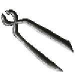
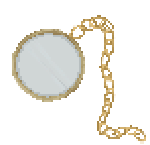

# Longfinger
*An interactive text adventure based on choices.*

[WORK IN PROGRESS]

Unity Ver: 2018.2.8f1

To be exported as Standalone

Twine Prototype in Twine version 2.2.1, Story Format SugarCube 2.21.0

Longfinger is an interactive Story, meaning different endings depending on what you choose to do in the game.
The target demographic is anyone from 12 to 99 who likes text adventures and visual novels. 

This game is a school project in which we were given three prompt words to draw from a bunch. The words our Group (Sarah, 
Elena, Teto) drew were **Shop, Finger and Comet.** The words were interpreted in a more liberal, poetic sense rather than actual 
story elements.

The story goes as such:
The Player, poor and freezing, is searching for food or a place to stay the night.
Shortly they find Mr. M's Marvelous Antequities, a strange store that seems to have never been there before.
The player soon finds out the Store is led by a certain Mr. Mephis who prompts you to a quest to procure a list of items in 
exchange for food and housing.
Will you take on the quest? Play the game and find out.

----
### *Screenshot of the Twine Prototype, Twine version 2.2.1, Story Format SugarCube 2.21.0*

----

### *Screenshot of current Game Progress* 

---

### *Sprite Preview*

---
*So what exactly is a Text Adventure?*

Per definition it's this: A computer game in which the player is given a textual description of the environment.

Now some may argue a text adventure needs a command line or other extra but in our opinion a text adventure is grounded in 
reading, so any game where reading and text is the main component of the gameplay is considered a text adventure to us. 

Our game is supposed to be an interactive story. You could even say it's more of a story than a game. But we still hope it's
a fun experience for anyone playing. Our story has three endings, one of them being a shortcut and two of them being true 
endings, depending on your choices throughout the game.

Our story is pretty phantastical, in the beginning it's vibe is almost eerie and it doesn't become much more light hearted 
throughout. We wanted to give a fairytale sort of feel through a script based font and UI that is based on a book. Like most 
children's or fairytale books the text is on one page and an illustration occupies the other.

The hardest part in the making of this game was without a doubt time management. We spent way too much time on the concept and visual aspect as opposed to game logic or coding (and the planning of those things).

(C) Teto Gürel, Elena Sevignani, Sarah Loos
